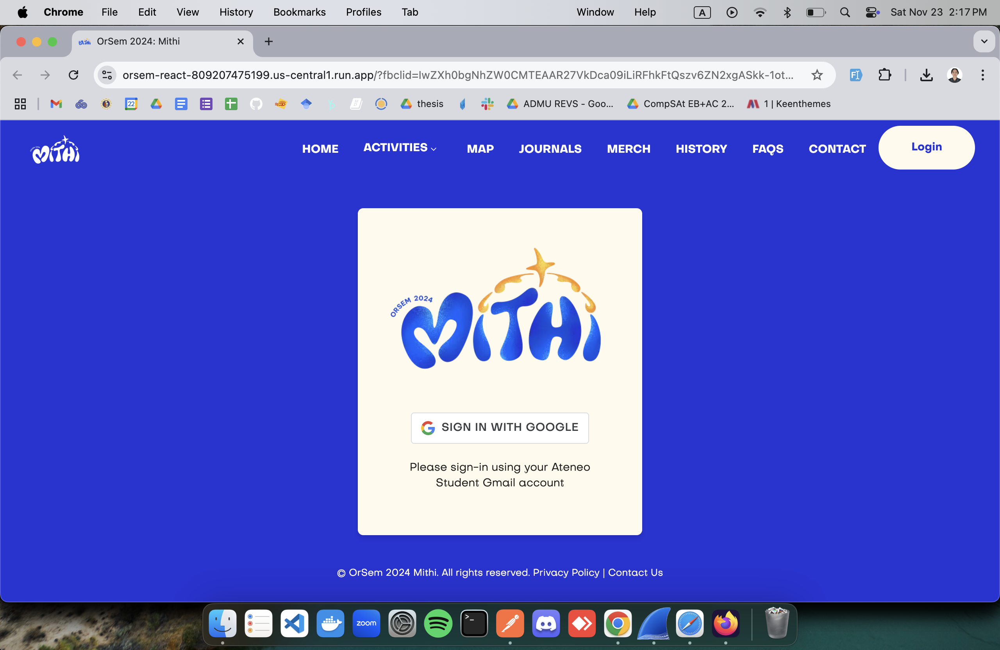

# 🏡️ Orsem Official Website

Orsem is the Ateneo De Manila University orientation seminar for incoming freshmen students. Here, students will learn about the different buildings, facilities and culture of Ateneo and its students.

## 🔧️ Installation Guide

1. Ensure that you have [Git](https://git-scm.com/) installed.

2. Go to the folder where you wish to install the repository, then open your terminal to that directory.

3. Type the following commands to clone the repository to your local machine:

   ```bash
   git clone https://gitlab.com/misa.eservices/orsem2020.git
   ```

## 📂 File Structure

`orsem-django` - Main backend component of the application, made with Django

`orsem-react` - Main frontend component of the application, made with Create React App

_NOTE: Refer to the `README.md` in each folder to find their respective documentation_

## 🌳 Branch Structure

`main` - **PRODUCTION** branch of the application. Reflects what is visible to the public. Should only accept merges from `staging`.

`staging` - Mirror of the production environment for testing. For internal use only. Should only accept merges from dev branches.

`[name]-[feature]-dev` - Additional features should be split into its own branch (ex. `echo-update-frontend-dev`).

## 🚀 Deployment Process

This guide outlines the steps for building Docker images, pushing them to a container registry, configuring CloudSQL, deploying the application to a Kubernetes cluster, and exposing the services using Kubernetes resources.

---

## 🛠 Prerequisites

Before proceeding, ensure the following:

1. You have a **Google Cloud Platform (GCP)** project set up.
2. **Google Cloud Run** will be used for deploying the application.
3. The **Cloud Run API** and **Cloud SQL Admin API** are enabled in your GCP project.
4. You have the **Google Cloud CLI (`gcloud`)** installed and authenticated.
5. Billing is enabled for your GCP project.
6. Access to a container registry (e.g., Google Container Registry or Docker Hub).

---

## 1️⃣ Clone the Repository on Google Cloud

1. Access the Google Cloud Console or activate the Google Cloud Shell.
2. Clone the project repository into the Google Cloud environment:
   ```bash
   git clone https://github.com/panghuuuuu/ISCS-30.23-XW.git
   ```

## 2️⃣ Configure CloudSQL

If you're using **Google Cloud SQL** for your database, follow these steps to configure it:

### Create CloudSQL Instance

1. Go to the [Google Cloud Console](https://console.cloud.google.com).
2. Navigate to **SQL** and create a new instance. Choose **PostgreSQL** or your desired database.
3. Once the instance is created, get the **instance connection name**, which will be used in your `.env` file.

### Set Up Access to CloudSQL

1. Enable the **Cloud SQL Admin API**.
2. Add the CloudSQL instance's connection name to the Kubernetes deployment configurations to allow access from the application.

### Create a Database

1. In your CloudSQL instance, create the necessary database for your application.

### Get Database Credentials

1. Note the **database username**, **password**, and the **connection name**. These will be used in your `.env` file.

### Setup `.env` file

1. Navigate to the `orsem-django` folder.

2. Make a copy of the `.env.example` file and rename it to `.env`:

   ```bash
   cp .env.example .env
   ```

3. Update the `.env` file with the credentials and details from your CloudSQL configuration.

4. Ensure that the following variables in the `.env` file are updated:

   - `DB_NAME`
   - `DB_USER`
   - `DB_PASSWORD`
   - `DB_HOST` (set this to the CloudSQL instance's connection name)
   - `DB_PORT`

   Example:

   ```bash
   SECRET_KEY="t8!=@d!hn$b7c0^dh1z+m&9zuomrq=w!o77#lg!=yn_g7ex=88"
   DB_NAME="django"
   DB_USER="admin"
   DB_PASSWORD="Ors3mMul1"
   DB_HOST="/cloudsql/stone-flux-442503-d1:us-central1:django"
   DB_PORT="5432"
   POSTGRES_DB="django"
   POSTGRES_USER="admin"
   POSTGRES_PASSWORD="Ors3mMul1"
   USE_S3="False"
   CLOUD_NAME="dommshw6n"
   CLOUD_API_KEY="822444996822321"
   CLOUD_API_SECRET="Na8raROPQJEr5ZxSy54zDS1esDw"
   DJANGO_GOOGLE_OAUTH2_CLIENT_ID=""
   DJANGO_GOOGLE_OAUTH2_CLIENT_SECRET=""
   RECIPIENT_LIST="orsem.ls@obf.ateneo.edu"
   EMAIL_HOST_USER="mailertester20@gmail.com"
   EMAIL_HOST_PASSWORD="nuUnR7fEIs9L"

   # for production use prodsettings
   BASE_APP_URL=https://orsem-react-809207475199.us-central1.run.app
   BASE_BACK_END_URL=https://orsem-django-809207475199.us-central1.run.app
   ```

5. Save the `.env` file after making the necessary updates.

---

## 3️⃣ Build Docker Images

### Backend (`orsem-django`)

1. Navigate to the `orsem-django` folder.

2. Build the Docker image for the backend:

   ```bash
   docker build -t orsem-django:latest .
   ```

   This command will build the Docker image tagged as `orsem-django:latest`.

### Frontend (`orsem-react`)

1. Navigate to the `orsem-react` folder.

2. Build the Docker image for the frontend:

   ```bash
   docker build -t orsem-react:latest .
   ```

   This will build the Docker image tagged as `orsem-react:latest`.

---

## 4️⃣ Push Docker Images to a Container Registry

To deploy to Cloud Run, you need to push your Docker images to a container registry.

### Using Google Container Registry (GCR)

#### Please follow this [tutorial](https://www.cloudskillsboost.google/focuses/10445?parent=catalog) to learn how to push and manage Docker images in Google Container Registry.

1. Tag the Docker images with your GCP project ID:
   ```bash
   docker tag orsem-django:latest gcr.io/<project-id>/orsem-django:latest
   docker tag orsem-react:latest gcr.io/<project-id>/orsem-react:latest
   ```
2. Push the Docker images to Google Container Registry
   ```bash
   docker push gcr.io/<project-id>/orsem-django:latest
   docker push gcr.io/<project-id>/orsem-react:latest
   ```

### Using Dockerhub

- Tag the Docker images with the following commands:

  ```bash
  docker tag orsem-django:latest <your-dockerhub-username>/orsem-django:latest
  docker tag orsem-react:latest <your-dockerhub-username>/orsem-react:latest
  ```

## 5️⃣ Deploying App

### Deploying App in CloudRun

Please follow the instructions in [Task 3. Deploy the container to Cloud Run](https://www.cloudskillsboost.google/focuses/10445?parent=catalog) to deploy both your backend and frontend in Cloud Run.

**Sample Output:**

**Backend**:

**Frontend**:


### Deploying App in Kubernetes

### Prerequisite: Configure Cloud SQL for Kubernetes Deployment

Before deploying your application to Kubernetes, you need to configure access to your Cloud SQL instance. This involves setting up a Cloud SQL instance, creating credentials, and ensuring your Kubernetes deployment can securely connect to the database using the Cloud SQL Proxy.

### 1️⃣ Download Service Account Credentials

1. Navigate to the [Service Accounts Console](https://console.cloud.google.com/iam-admin/serviceaccounts).
2. Create or locate a service account with the **Cloud SQL Client** role.
3. Click **Manage Keys** for the service account, then **Add Key** → **Create New Key** → **JSON**.
4. Download the JSON file and save it securely.

### 2️⃣ Create a Kubernetes Secret for Cloud SQL Credentials

1. Use the downloaded JSON file to create a Kubernetes Secret:
   ```bash
   kubectl create secret generic cloudsql-credentials \
       --from-file=credentials.json=<path-to-your-json-key>
   ```

### 3️⃣ Deploy

### 🛠 Prerequisites

Before deploying your application, ensure the following are updated in your deployment files:

- **Image**: Update the `image` field to reflect the correct container image for your application (e.g., Docker image name and version/tag).
- **Environment Variables**:
  - **DB_HOST**: Set this to the Cloud SQL instance's connection name. The format is `/cloudsql/<project-id>:<region>:<instance-id>`.
  - **DB_USER**: Set this to the database username, which you should retrieve from the Kubernetes secret (`postgres-secret` or similar).
  - **DB_PASSWORD**: Set this to the database password, also stored in a Kubernetes secret (`postgres-secret` or similar).

### Set Up a Kubernetes Cluster

Follow the instructions in [Task 1 of this tutorial](https://www.cloudskillsboost.google/focuses/19123?parent=catalog) to set up your Kubernetes cluster.

### Create Regional and Global Load Balancers

To create static public IP addresses and set up load balancing, refer to [Task 5: Create Static Public IP Addresses using Google Cloud Networking](https://www.cloudskillsboost.google/focuses/19123?parent=catalog).

Note: Create two separate load balancers for frontend and backend.

### Deploy to Kubernetes

Navigate to the `kubernetes-manifests` directory to apply the Kubernetes manifests step-by-step:

1. Change into the `kubernetes-manifests` directory:

   ```bash
   cd kubernetes-manifests
   ```

2. Apply the `postgres-secret.yaml` file to create database credentials as Kubernetes Secrets:

   ```bash
   kubectl apply -f postgres-secret.yaml
   ```

3. Deploy the first version of the backend (`orsem-django`):

   ```bash
   kubectl apply -f orsem-django-deployment.yaml
   ```

4. Deploy the updated version of the backend (`orsem-django` v2):

   ```bash
   kubectl apply -f orsem-django-deployment-v2.yaml
   ```

5. Deploy the first version of the frontend (`orsem-react`):

   ```bash
   kubectl apply -f orsem-react-deployment.yaml
   ```

6. Deploy the updated version of the frontend (`orsem-react` v2):
   ```bash
   kubectl apply -f orsem-react-deployment-v2.yaml
   ```
7. Deploy service manifests:

Follow the instructions in [Define service types in the manifest](https://www.cloudskillsboost.google/focuses/19123?parent=catalog) match the addresses for the regional-loadbalancer for the reserved static ip-address.

### Note:

Make sure you replace `regional-loadbalancer` with the name of the load balancer you created.

- 1. **Get the static IP address of the regional load balancer**:
     Replace `regional-loadbalancer` with the name of the load balancer you created for the backend.

```bash
export STATIC_LB=$(gcloud compute addresses describe regional-loadbalancer --region REGION --format json | jq -r '.address')
```

Replace `REGION` with the appropriate region where your load balancer was created.

- 2. Update the backend service YAML file (`orsem-django-service.yaml`) by replacing the IP address placeholder:

  ```bash
  sed -i "s/10\.10\.10\.10/$STATIC_LB/g" orsem-django-service.yaml
  ```

  This will update the backend service YAML file (`orsem-backend-service.yaml`) with the correct static IP address.

- 3. Run the command from Step 1 to get the static IP address of the regional load balancer (`frontend`)
     Replace `regional-loadbalancer` with the name of the load balancer you created for the frontend.

  ```bash
  sed -i "s/10\.10\.10\.11/$STATIC_LB/g" orsem-react-service.yaml
  ```

  This will update the frontend service YAML file (`orsem-react-service.yaml`) with the correct static IP address.

- 4. Deploy service manifests

  ```bash
  kubectl apply -f orsem-django-service.yaml
  kubectl apply -f orsem-react-service.yaml
  ```

  **Sample Output:**

**Backend**:

**Frontend**:


---
